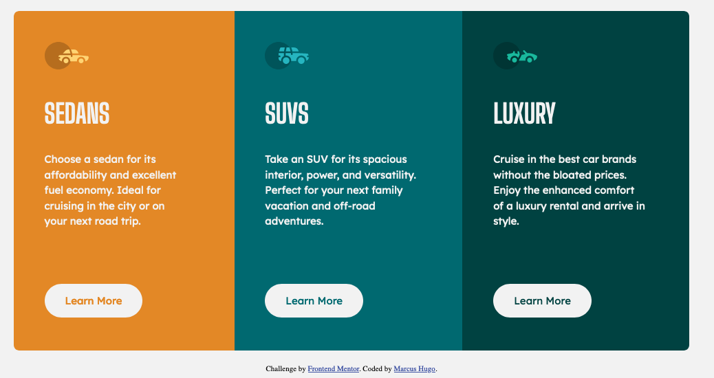

# Frontend Mentor - 3-column preview card component solution

This is a solution to the [3-column preview card component challenge on Frontend Mentor](https://www.frontendmentor.io/challenges/3column-preview-card-component-pH92eAR2-). Frontend Mentor challenges help you improve your coding skills by building realistic projects.

## Table of contents

- [Overview](#overview)
  - [The challenge](#the-challenge)
  - [Screenshot](#screenshot)
  - [Links](#links)
- [My process](#my-process)
  - [Built with](#built-with)
  - [What I learned](#what-i-learned)
  - [Continued development](#continued-development)
  - [Useful resources](#useful-resources)
- [Author](#author)
- [Acknowledgments](#acknowledgments)

## Overview

### The challenge

Users should be able to:

- View the optimal layout depending on their device's screen size
- See hover states for interactive elements

### Screenshot

### Links

- Solution URL: [https://github.com/marcus-hugo/3-column-preview-card-component-main](https://your-solution-url.com)
- Live Site URL: [https://marcus-hugo.github.io/3-column-preview-card-component-main/](https://marcus-hugo.github.io/3-column-preview-card-component-main/#)

## My process

### Built with

- HTML5
- CSS
- Flexbox
- [Styled Components](https://styled-components.com/) - For styles

### What I learned
Basic folder structer for web development.  Created a styles folder for my css file.  Completely
reworked the css file.  I used flexbox to center the content. 
I made variables for colors and fonts.  Focused on combing selectors when they shared the same properties.

### Continued development
Keeping an organized consistnet approach with a folder structures and css.

### Useful resources

## Author
- Website - [Marcus Hugo](https://www.your-site.com)
- Frontend Mentor - [@yourusername](https://www.frontendmentor.io/profile/@marcus-hugo)

## Acknowledgments
